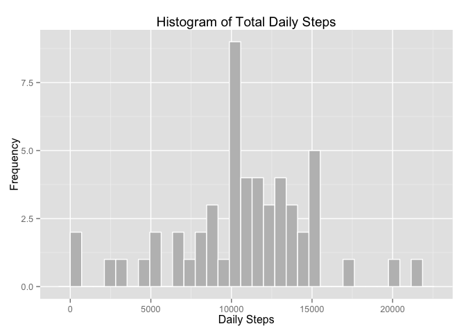
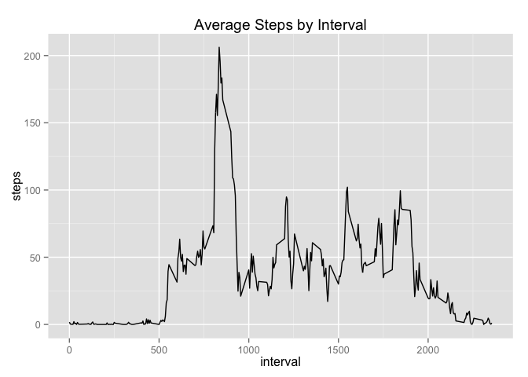
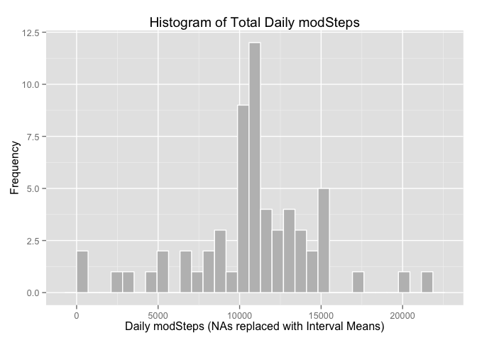
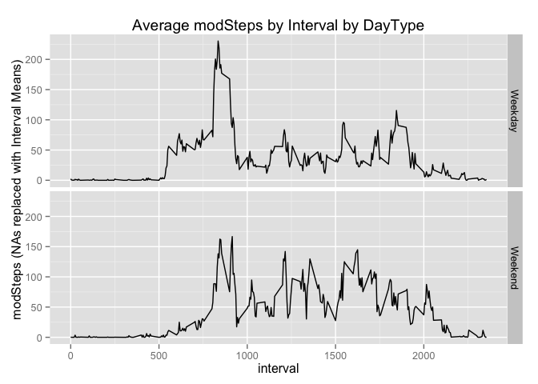

# Reproducible Research: Peer Assessment 1
by Sebastian Cruz

## Loading and preprocessing the data

```r
# Load Libraries
library(ggplot2)

# Set your Present Working Directory (pwd)
# Edit as necessary
setwd("~/GitHub/RepData_PeerAssessment1")

# Unzip Data
download.file( url="https://d396qusza40orc.cloudfront.net/repdata%2Fdata%2Factivity.zip", destfile="activity.zip", method = "curl")
unzip("activity.zip")

# Import Data
act_raw = read.csv("activity.csv", header = TRUE)

# Clean Data (No NA)
act_clean = act_raw[complete.cases(act_raw), ]
```

## What is mean total number of steps taken per day?
1. Make a histogram of the total number of steps taken each day

```r
# Aggregate Steps by Date
act_clean_sumByDate = aggregate(steps ~ date, data=act_clean, FUN=sum)

# Histogram of Step Sum by Date
qplot(act_clean_sumByDate$steps,
      geom = "histogram",
      fill = I("grey"),
      col = I("white"),
      main = "Histogram of Total Daily Steps",
      xlab = "Daily Steps",
      ylab = "Frequency"
      )
```

 

2. Calculate and report the mean and median total number of steps taken per day

```r
mean(act_clean$steps)
```

```
## [1] 37.3826
```

```r
median(act_clean$steps)
```

```
## [1] 0
```


## What is the average daily activity pattern?
1. Make a time series plot (i.e. type = "l") of the 5-minute interval (x-axis) and the average number of steps taken, averaged across all days (y-axis)

```r
# Aggregate by Interval
act_clean_avgByInterval = aggregate(steps ~ interval, data=act_clean, FUN= mean)
# Plot Average Steps by Interval
qplot(interval, steps, data=act_clean_avgByInterval, 
      geom="line",
      main="Average Steps by Interval")
```

 

2. Which 5-minute interval, on average across all the days in the dataset, contains the maximum number of steps?

```r
act_clean_avgByInterval$interval[which.max(act_clean_avgByInterval$steps)]
```

```
## [1] 835
```


## Imputing missing values
1. Calculate and report the total number of missing values in the dataset
(i.e. the total number of rows with NAs)

```r
sum(is.na(act_raw))
```

```
## [1] 2304
```

2. Devise a strategy for filling in all of the missing values in the dataset. The strategy does not need to be sophisticated. For example, you could use the mean/median for that day, or the mean for that 5-minute interval, etc.

- I will use the mean for a given 5-minute interval to replace NA values
  
3. Create a new dataset that is equal to the original dataset but with the missing data filled in.

```r
#Left Join act_clean_avgByInterval (Avg Steps by Interval, No NAs) to act_raw (has NAs)
act_full = merge(act_raw, act_clean_avgByInterval, by="interval", all.x=TRUE)
# Create new column modSteps that uses avg steps for those intervals that are NA
act_full$modSteps = ifelse(is.na(act_full$steps.x), act_full$steps.y, act_full$steps.x)
```

4. Make a histogram of the total number of steps taken each day and Calculate and report the mean and median total number of steps taken per day. Do these values differ from the estimates from the first part of the assignment? What is the impact of imputing missing data on the estimates of the total daily number of steps?

```r
# Aggregate Steps by Date
act_full_sumByDate = aggregate(modSteps ~ date, data=act_full, FUN=sum)

# Histogram of Step Sum by Date
qplot(act_full_sumByDate$modSteps,
      geom = "histogram",
      fill = I("grey"),
      col = I("white"),
      main = "Histogram of Total Daily modSteps",
      xlab = "Daily modSteps (NAs replaced with Interval Means)",
      ylab = "Frequency"
      )
```

 


```r
mean(act_full$modSteps)
```

```
## [1] 37.3826
```

```r
median(act_full$modSteps)
```

```
## [1] 0
```

- The mean and median values between the original dataset, act_raw, and a dataset with NAs replaced, act_full, compared

```r
# Means Compared
mean(act_clean$steps) - mean(act_full$modSteps)
```

```
## [1] 0
```

```r
# Medians Compared
median(act_clean$steps) - median(act_full$modSteps)
```

```
## [1] 0
```
 - There is no impact between the original and imputed datasets for mean or median.

## Are there differences in activity patterns between weekdays and weekends?
1. Create a new factor variable in the dataset with two levels – “weekday” and “weekend” indicating whether a given date is a weekday or weekend day.

```r
# Append Weekend/Weekday as new factor column
act_full$DayType = factor(ifelse(weekdays(as.Date(act_full$date)) %in% c("Saturday", "Sunday"), "Weekend", "Weekday"))
```

2. Make a panel plot containing a time series plot (i.e. type = "l") of the 5-minute interval (x-axis) and the average number of steps taken, averaged across all weekday days or weekend days (y-axis).

```r
# Aggregate by Interval
act_full_avgByIntervalByDayType = aggregate(modSteps ~ interval + DayType, data=act_full, FUN=mean)

# Plot Average modSteps by Interval by DayType
ggplot(data=act_full_avgByIntervalByDayType, aes(x=interval, y=modSteps)) + 
  geom_line() + 
  facet_grid(DayType~.) +
  ggtitle("Average modSteps by Interval by DayType") +
  ylab("modSteps (NAs replaced with Interval Means)")
```

 

